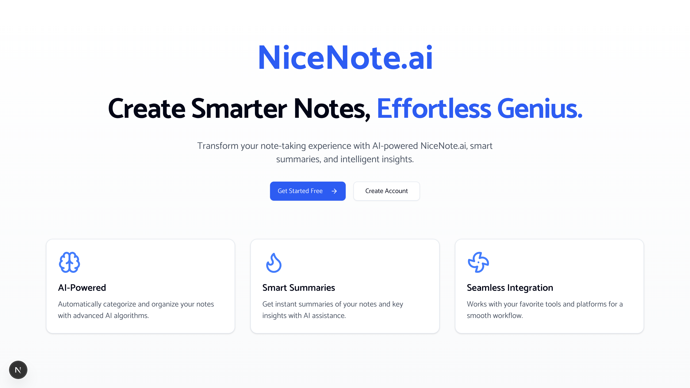
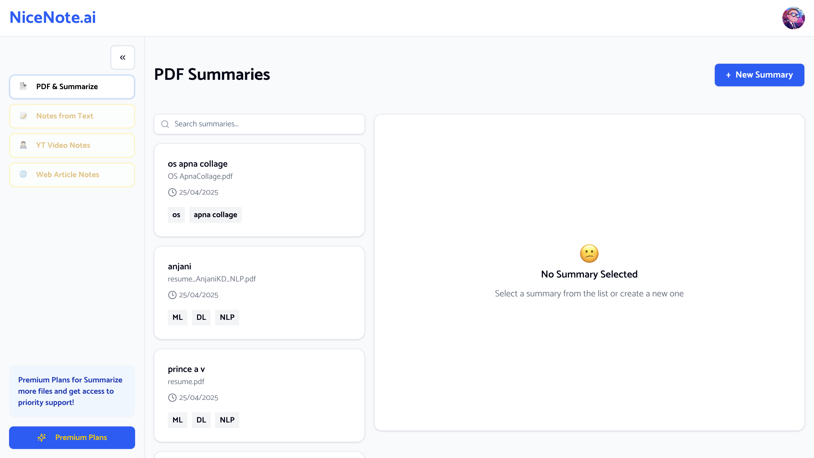
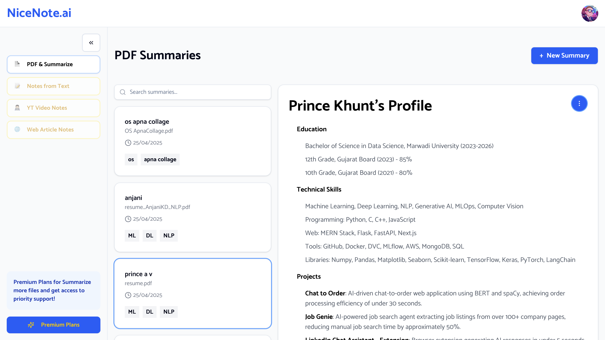
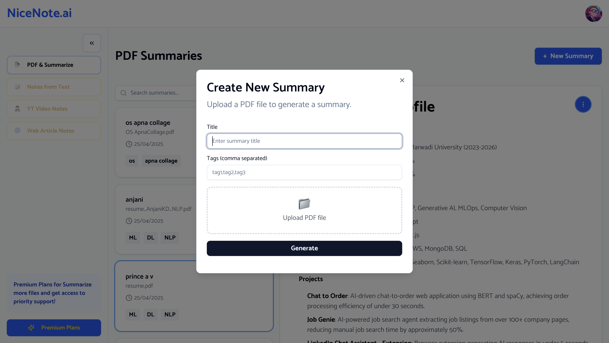

# 🧠 NiceNote.ai - AI Notes App

AI Notes App is a full-stack web application built using Next.js, Supabase, React Query, and the Groq AI API. It allows users to upload PDF files, automatically extract text, generate concise summaries using AI, and manage their notes effectively.

---

## 🚀 Features

- 📄 Upload PDF files and extract text directly in the browser
- 🤖 Generate AI-powered summaries using the Groq API
- 🗂️ Create, Read, Edit, Delete (CRUD) notes
- 🔐 User authentication via Supabase
- 🧠 Summaries stored in Markdown format
- 🔍 React Query for data caching and mutation handling

---

## 🛠️ Tech Stack

- **Frontend**: Next.js (App Router), TailwindCSS, React Query
- **Backend**: Supabase (PostgreSQL + Auth)
- **AI Integration**: Groq's llama3-8b-8192 model

---

## 📁 Project Structure



---

## 🔧 Setup Instructions

1. **Clone the repository**

```bash
git clone https://github.com/PrinceKhunt16/NiceNote.ai
cd NiceNote.ai
```

2. **Install dependencies**

```bash
npm install
```

3. **Configure environment variables**

Create a `.env.local` file and add:

```env
NEXT_PUBLIC_SUPABASE_URL=your-supabase-url
NEXT_PUBLIC_SUPABASE_ANON_KEY=your-supabase-anon-key
NEXT_PUBLIC_GROQ_API_KEY=your-groq-api-key
SUPABASE_PASSWORD=your-supabase-password
SUPABASE_DB_NAME=your-supabase-db-name
```

4. **Run the dev server**

```bash
npm run dev
```

---

## Previews







--- 

## 👏 Credits

Built with ❤️ using Next.js, Supabase, React Query, and Groq API, Shadcn, TailwindCSS